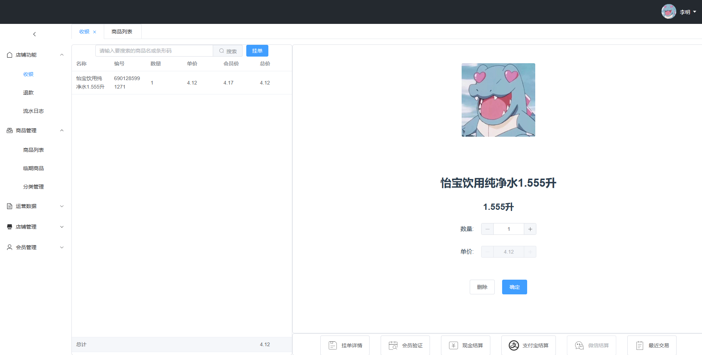
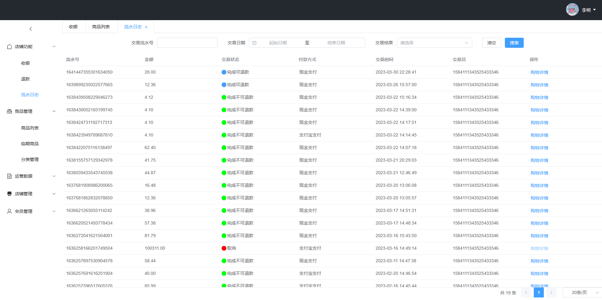
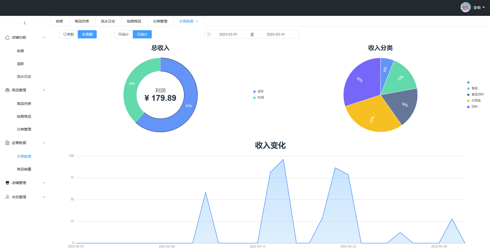

# Wisdom cashier
- A retail cashier management system based on Vue, Spring Boot and Spring Cloud Alibaba with separate front and back end and distributed architecture.
- Support the functions of commodity sale, management and settlement.
- Provide business data and online cashier services for merchants.
- Support mobile payments such as Alipay.

Jar package version is mainly used in the backend:

| dependency                                      | version        |
|:------------------------------------------------|----------------|
| Java                                            | 21             |
| spring-boot-dependencies                        | 3.1.4          |
| spring-boot-starter-web                         |                |
| spring-boot-starter-security                    |                |
| spring-boot-starter-oauth2-authorization-server |                |
| spring-boot-starter-data-redis                  |                |
| spring-boot-starter-data-amqp                   |                |
| spring-cloud-dependencies                       | 2022.0.4       |
| spring-cloud-starter-gateway                    |                |
| spring-cloud-starter-loadbalancer               |                |
| spring-cloud-starter-openfeign                  |                |
| spring-cloud-alibaba-dependencies               | 2022.0.0.0-RC2 |
| spring-cloud-starter-alibaba-nacos-config       |                |
| spring-cloud-starter-alibaba-nacos-discovery    |                |
| spring-cloud-starter-alibaba-sentinel           |                |
| mysql-connector-j                               | 8.0.33         |
| lombok                                          | 1.18.30        |
| mybatis-plus-boot-starter                       | 3.5.3          |
| guava                                           | 18.0           |
| knife4j                                         | 4.4.0          |
| mapstruct                                       | 1.5.5.Final    |
| redisson-spring-boot-starter                    | 3.22.1         |
| dubbo                                           | 3.2.2          |
| alipay-sdk-java                                 | 4.35.79.ALL    |
| minio                                           | 8.4.1          |

It can be used for learning and reference.

test username：test01\
password：123456789qwer

## Screenshots of some functions

## Project supported by JetBrains

- Many thanks to Jetbrains for kindly providing a license for me to work on this and other open-source projects:
  

