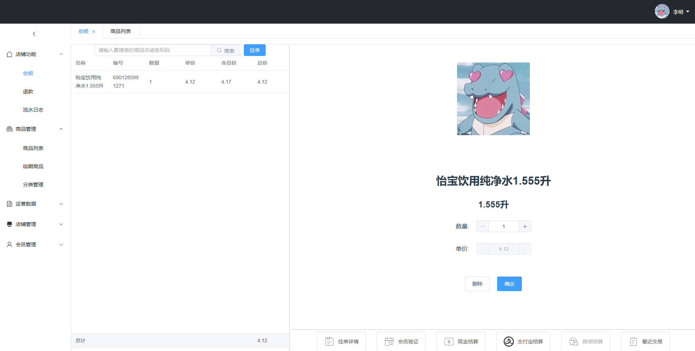
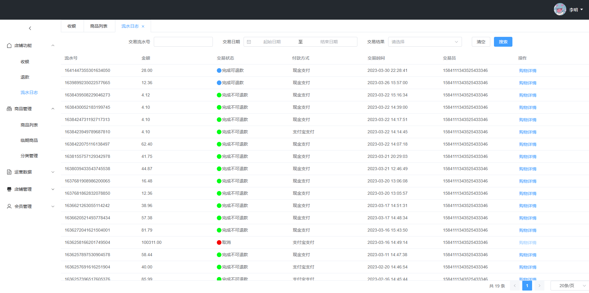
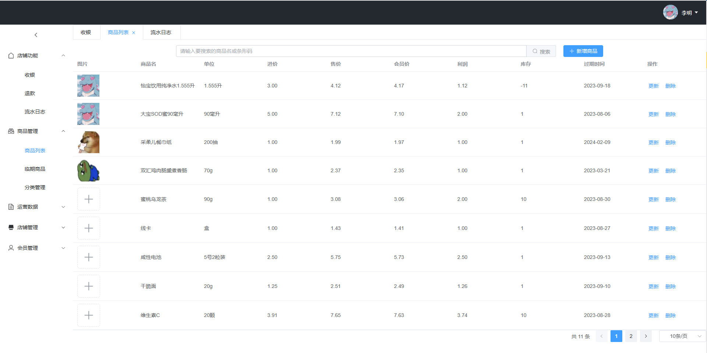

## 智慧收银
一款零售业收银客户与服务端,实现商品出售、管理、结算功能。为商家提供营业数据以及在线收银服务

前端由Vue3.0编写,主要使用pinia和Element-Plus

后端由Java编写，使用Springboot框架及 Mybatis-plus、redis、mysql、minIO、shiro等

可供学习参考

测试账号：\
    test01\
    123456789qwer

## WisdomCashier

A Software for Retail trade.

The web is provided by Vue3.0 and use pinia、elementPlus

The api is provided by Springboot and use Mybatis-plus、redis、mysql、minIO、shiro.

## 部分功能截图

